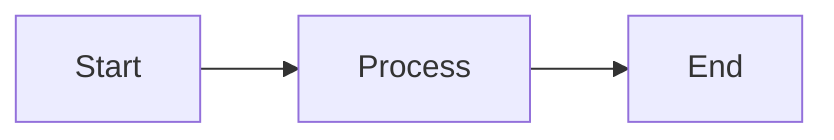

# Agent Guidelines

## Documentation Structure

### Project Root (`./`)
- **README.md ONLY** - Keep the project root clean with just the main README
- No other documentation files should be placed at the root level

### Specifications & Documentation (`./specs`)

**CRITICAL: All specs MUST live in `./specs/`**

- ✅ **Canonical location**: `./specs/` (root-level specs directory)
- All technical specifications should be placed in `./specs/`
- All work-in-progress documentation should be placed in `./specs/`
- All audit reports, fix summaries, and implementation notes should be placed in `./specs/`
- Organize documents by topic/feature within the specs directory

**When encountering duplicate spec files:**
1. **Check modification dates FIRST**: Use `ls -lh` or `stat` to compare timestamps
2. **Compare content**: Use `diff` to verify which version is more complete
3. **Ask user for confirmation**: NEVER automatically overwrite or delete without explicit approval
4. **Assume nothing**: Older files may contain unique content not in newer versions
5. **Document consolidation**: Explain what was merged/moved in commit messages

### Code Documentation
- Code should be well-commented with inline documentation
- Complex algorithms should reference the relevant spec document in `./specs/`
- Use NatSpec format for Solidity contracts

## File Organization

```
/
├── README.md                    # Main project README only
├── specs/                       # ✅ CANONICAL: All documentation and specs HERE
│   ├── ARCHITECTURE.md
│   ├── ORACLE.md
│   ├── FEES.md
│   ├── ALM_AND_COVERAGE.md
│   ├── CIRCUIT_BREAKERS.md
│   ├── LIABILITY_TIME_DECAY.md
│   ├── TOKENOMICS.md
│   ├── ALLOCATION_AND_VESTING.md
│   └── ...
├── contracts/
│   ├── src/
│   │   ├── specs/               # ❌ DEPRECATED: Do not use, may be outdated
│   │   └── ...
│   └── ...
├── sdk/                         # SDK implementation
└── ...
```

## SDK as Source of Truth

**CRITICAL: All token, chain, and contract metadata lives in the SDK, not the frontend.**

### Canonical Data Locations
| Data | SDK File | Import |
|------|----------|--------|
| Token metadata (symbol, name, decimals, icon) | `sdk/src/eth/tokens.ts` | `import { TOKENS } from '@sdk/eth'` |
| Token addresses by chain | `sdk/src/eth/tokens.ts` | `import { TOKEN_ADDRESSES } from '@sdk/eth'` |
| Chain configs (name, rpc, icon) | `sdk/src/eth/chains.ts` | `import { CHAINS } from '@sdk/eth'` |
| Deployed contract addresses | `sdk/src/eth/contracts.ts` | `import { CONTRACTS } from '@sdk/eth'` |
| Canonical tokens (no WETH/WBTC) | `sdk/src/eth/tokens.ts` | `import { CANONICAL_TOKENS } from '@sdk/eth'` |
| Base/quote token lists | `sdk/src/eth/tokens.ts` | `import { BASE_TOKENS, QUOTE_TOKENS } from '@sdk/eth'` |

### Token Lists
- **CANONICAL_TOKENS**: Excludes wrapped tokens (WETH, WBTC). Use for CEX-style pair selectors.
- **ALL_TOKENS**: Includes wrapped tokens. Use for on-chain token selection (deposits, withdrawals).
- **BASE_TOKENS**: Tokens that can be base in trading pairs.
- **QUOTE_TOKENS**: Tokens that can be quote currencies (USDC, USDT, ETH, BTC, DAI, USDE).

### Helper Functions
```typescript
// Tokens
getAllTokensForChain(chainId)  // Returns { symbol: address } for chain
getTokenAddress(symbol, chainId) // Returns address or undefined

// Chains
getChainInfo(chainId)          // Returns { id, name, icon, nativeSymbol }
getAllChainInfo()              // Returns Record<chainId, ChainInfo>
getSupportedChainIds()         // Returns all chain IDs

// Contracts
getContractAddress(chainId, name) // Returns deployed address
isChainSupported(chainId)         // Type guard for supported chains
```

### Rules
1. **NEVER duplicate token/chain/contract metadata in frontend** - Always import from `@sdk/eth`
2. **Add new tokens to `sdk/src/eth/tokens.ts`** - Not to frontend files
3. **Add new chains to `sdk/src/eth/chains.ts`** - Includes RPC, explorer, icon, native currency
4. **Add deployed contracts to `sdk/src/eth/contracts.ts`** - By chain ID
5. **No contracts.ts in frontend** - Deleted; import directly from SDK

### Example: Adding a New Token
```typescript
// sdk/src/eth/tokens.ts
export const TOKEN_ADDRESSES: Record<string, TokenMapping> = {
  // ... existing tokens
  NEW: {
    "1": "0x...",    // Ethereum mainnet
    "42161": "0x...", // Arbitrum
  },
};

export const TOKENS: Record<string, TokenMetadata> = {
  // ... existing tokens
  NEW: { symbol: 'NEW', name: 'New Token', decimals: 18, icon: '/tokens/new.svg' },
};
```

### Example: Adding Deployed Contracts
```typescript
// sdk/src/eth/contracts.ts
export const CONTRACTS = {
  // ... existing chains
  10: {  // Optimism
    AIMM_FACTORY: '0x...' as Address,
    AIMM_POOL: '0x...' as Address,
  },
};
```

---

## Frontend Stack

**CRITICAL: Frontend uses ONLY Tailwind CSS + Radix UI + Preact**

### Core Dependencies (Keep Lean)
- ✅ **Framework**: Preact (NOT React - use preact/compat alias)
- ✅ **Styling**: Tailwind CSS v3 (utility-first CSS framework)
- ✅ **Components**: Radix UI primitives (headless, accessible components)
- ✅ **Charts**: chart.js with minimal custom wrapper for bar charts, pie charts, sparklines, heatmaps. Tradingview Lightweight Charts for main linecharts, area charts, candlestick charts
- ✅ **Markdown**: markdown-wasm (fast, lightweight)
- ✅ **Math**: asciimath2ml (~15KB, AsciiMath → MathML conversion)

### Forbidden Dependencies (Bloat)
- ❌ **NO React packages**: react, react-dom (use Preact with compat aliases)
- ❌ **NO extra UI frameworks**: Stick to Tailwind + Radix only, no heavy tailwind extensions like tailwind-animate
- ❌ **NO react-chartjs-2**: Use our minimal Chart wrapper instead
- ❌ **NO marked/markdown-it/mdx/sehype/remark**: @mdx-js/react, @mdx-js/rollup (we are using markdown-wasm and a minimal wrapper)
- ❌ **NO gray-matter**: Unnecessary bloat
- ❌ **NO mermaid in frontend bundle**: Mermaid is ~800KB, too heavy for client. We use build-time SVG compilation instead (see Mermaid Diagrams section below)
- ❌ **NO KaTeX/MathJax**: ~500KB+ gzipped, use asciimath2ml (~15KB) instead

### Bundle Size Philosophy
- Keep dependencies minimal
- Prefer native/lightweight alternatives
- Use lazy loading for heavy features
- No wrapper libraries when simple alternatives exist
- Measure: Final bundle should be <500KB gzipped

### Reusable UI Components (DRY Pattern)

**Consolidation Utilities (Phase 3)**

- **SocialLinkButton** (`@components/ui/SocialLinkButton.tsx`) - Social media link button
  ```tsx
  <SocialLinkButton
    icon="/icons/x.svg"
    url="https://x.com/..."
    title="X (Twitter)"
    onClick={openExternalLink}
    variant="disclaimer" // or "default"
  />
  ```
  - Variants: `disclaimer` (img-based), `default` (MaskIcon)
  - **Consolidates**: DisclaimerPage, Footer social links (4 duplicates → 1)

- **ImageWithFallback** (`@components/ui/ImageWithFallback.tsx`) - Image with auto fallback
  ```tsx
  <ImageWithFallback
    src={icon}
    alt="Wallet"
    fallbackSrc="/brand/logo-b.svg"
    className="w-full h-full object-contain"
  />
  ```
  - Auto-fallback to `/brand/logo-b.svg` on load error
  - **Consolidates**: Icon loading patterns with fallback handlers (3+ duplicates)

- **WalletItemButton** (`@components/ui/WalletItemButton.tsx`) - Wallet item button (detected/discover/default)
  ```tsx
  <WalletItemButton
    name={wallet.name}
    icon={wallet.icon}
    onClick={handler}
    variant="detected" // "detected" | "discover" | "default"
    isConnecting={false}
    tooltip="Optional tooltip"
  />
  ```
  - Variants: `detected` (shows Check icon), `discover` (shows ExternalLink), `default`
  - **Consolidates**: WalletButton + DiscoverWalletButton (2 components → 1, saved 65 lines)

**Icons & Buttons**

- **MaskIcon** (`@components/ui/MaskIcon.tsx`) - SVG icon masking
  ```tsx
  <MaskIcon src="/icons/bell.svg" size="sm" aria-label="Notifications" />
  ```
  - Sizes: xs (3px), sm (4px), md (5px), lg (7px), xl (10px)
  - Default color: `var(--fg-2)`
  - **Savings**: ~200 lines (20+ uses)

- **IconButton** (`@components/ui/IconButton.tsx`) - Icon-only button
  ```tsx
  <IconButton
    icon={<MaskIcon src="/icons/bell.svg" />}
    onClick={handler}
    size="md"
    variant="ghost"
    aria-label="Notifications"
  />
  ```
  - Sizes: sm (8px), md (10px), lg (12px)
  - Variants: ghost, outlined, default
  - **Savings**: ~90 lines (15+ uses)

- **IconLabel** (`@components/ui/IconLabel.tsx`) - Icon with text label
  ```tsx
  <IconLabel
    icon={<MaskIcon src="/icons/gas.svg" />}
    label="Gas"
    iconSize="sm"
    gap={2}
  />
  ```
  - Icon sizes: xs, sm, md, lg
  - Gap: 1, 1.5, 2, 3, 4
  - **Savings**: ~80 lines (20+ uses)

**Feedback & Loading**

- **Spinner** (`@components/ui/Spinner.tsx`) - Loading spinner
  ```tsx
  <Spinner size="md" color="primary" />
  ```
  - Sizes: xs, sm, md, lg, xl
  - Colors: primary, foreground, muted
  - **Savings**: ~15 lines (5+ uses)

- **ModalActions** (`@components/ui/ModalActions.tsx`) - Standard modal footer buttons
  ```tsx
  <ModalActions
    onCancel={() => close()}
    onConfirm={() => save()}
    cancelLabel="Cancel"
    confirmLabel="Save"
  />
  ```
  - Variants: primary (default), default, destructive
  - Optional reverseOrder prop
  - **Savings**: ~60 lines (10+ uses)

**Thick Icons** (for UI dividers/arrows)

- Custom SVG icons with `stroke-width: 4` and `stroke-linecap: square`
- Located in `/public/icons/`:
  - `plus-thick.svg` - Bold plus for "Add token" buttons
  - `arrow-down-thick.svg` - Bold down arrow for swap direction
- Use with MaskIcon and `bg-bg-1` padding for "cut-out" effect against borders

**Badge Component** (`@components/ui/Badge.tsx`)
- **CANONICAL COMPONENT**: Use Badge for ALL tags, chips, badges, status labels, and small labeled elements
- **Aliases**: tag, chip, label, status-badge, "already paired" indicator
  ```tsx
  <Badge>Default Badge</Badge>
  <Badge variant="primary">Active Filter</Badge>
  <Badge variant="positive">Success</Badge>
  <Badge variant="negative">Error</Badge>
  ```
- **Consistent Styling** (all variants):
  - Padding: `px-1.5 py-0.5` (tight spacing)
  - Font: `text-xs font-medium`
  - Border-radius: `rounded-xs` (5px CSS variable)
  - Border: `border border-border` (subtle 1px border)
  - Display: `inline-flex items-center gap-1`
- **Variants**:
  - `default`: `bg-bg-2 text-fg-1` (grey on grey, most common)
  - `primary`: `bg-primary text-white` (primary highlight, active filters, "Current", "Already paired")
  - `positive`: `bg-green text-white` (success/positive states)
  - `negative`: `bg-red text-white` (error/negative states)
  - `code`: `bg-bg-2 text-fg-1 font-mono` (keyboard shortcuts, code snippets)

**Keyboard Shortcuts** (`@components/ui/KeyboardShortcut.tsx`)
- **KeyboardShortcut**: Single kbd display with label (uses Badge `code` variant)
  ```tsx
  <KeyboardShortcut keys="⌘K" label="Search" />
  <KeyboardShortcut keys={['Shift', 'K']} />
  ```
- **KeyboardShortcutGroup**: Container for multiple shortcuts, right-aligned
  ```tsx
  <KeyboardShortcutGroup shortcuts={[
    { keys: '↑↓', label: 'Navigate' },
    { keys: 'Enter', label: 'Select' },
  ]} />
  ```
- **Implementation**: Uses `<Badge variant="code">` internally for consistent styling with other badges
- **Styling**:
  - Padding: `px-1.5 py-0.5`
  - Colors: `bg-bg-2 border border-border`
  - Border-radius: `rounded-xs`
  - Font: `text-xs font-mono`
  - Always right-aligned in footers/menus

**Loading & Feedback**

- **Spinner** (`@components/ui/Spinner.tsx`) - Loading indicator
  ```tsx
  <Spinner size="md" color="primary" />
  ```
  - Sizes: xs, sm, md, lg, xl
  - Colors: primary, foreground, muted
  - **Savings**: ~15 lines (5+ uses)

**Modal Components**

- **ModalActions** (`@components/ui/ModalActions.tsx`) - Modal footer actions
  ```tsx
  <ModalActions
    onCancel={() => setOpen(false)}
    onConfirm={handleSubmit}
    confirmLabel="Save"
    confirmDisabled={!isValid}
  />
  ```
  - Consistent cancel/confirm button layout
  - Optional buttons (pass undefined to hide)
  - **Savings**: ~60 lines (10+ uses)

**Tooltips & Popovers** (`@components/ui/Tooltip.tsx`, `@components/ui/Popover.tsx`)
- **Tooltip**: Simple string content with arrow pointer (default)
  ```tsx
  <Tooltip content="Copy to clipboard" side="top" arrow>
    <button>Copy</button>
  </Tooltip>
  ```
- **Popover**: Rich ReactNode content, click-triggered, clickable content
  ```tsx
  <Popover content={<div><p>Complex content</p></div>} side="bottom">
    <button>Open</button>
  </Popover>
  ```
- **Shared Consistent Styling** (ALL tooltips/popovers use this):
  - Background: `bg-bg-1` (main UI background)
  - Text: `text-fg-1` (main foreground)
  - Padding: `px-3 py-2`
  - Border: `border border-border`
  - Border-radius: `rounded-lg`
  - Z-index: `z-tooltip` (120)
  - Shadow: `shadow-lg`
  - Arrow: 6px triangle with `bg-1` color
  - Font: `text-xs font-medium`
- **Props**:
  - `position` or `side`: 'top' | 'bottom' | 'left' | 'right' (default: 'top' for Tooltip, 'bottom' for Popover)
  - `arrow`: boolean (default: true)
  - `delay`: number in ms (Tooltip only, default: 0)
  - `maxWidth`: string (Popover only, default: auto)
  - `asChild`: boolean (renders container as block, default: false)
- **Copy Button**: Uses CSS-based tooltip with same styling as above (in `markdown.css`)

**Typography:**
- Body & Headings: Inter Variable
- Numeric/Mono: Mozilla Text, SF Mono, Monaco (fallback chain)
- Math: Native browser MathML fonts (STIX Two Math, Cambria Math, etc.)

### Reusable Hooks (Phase 2-3)

- **useWalletConnection** (`@hooks/useWalletConnection.ts`) - Wallet connection state management
  ```tsx
  const {
    agreedToTerms, connectingWallet, error, searchQuery, view, isLoadingWC, qrCodeUrl, wcUri, copied,
    setAgreedToTerms, setConnectingWallet, setError, setSearchQuery, setView,
    reset, handleBack, startWalletConnect, copyUri,
  } = useWalletConnection();
  ```
  - Consolidates 10 useState calls from WalletModal into 1 hook
  - Helpers: `reset()`, `resetSearch()`, `handleBack()`, `startWalletConnect()`, `setWalletConnectError()`, `copyUri()`
  - **Saves**: 38 lines (WalletModal refactoring)

- **useAsync** (`@hooks/useAsync.ts`) - Generic async data fetching
  ```tsx
  const { data, loading, error, refetch } = useAsync(fetchFunction, immediate, dependencies);
  ```
  - Pattern for async/await + useState + useEffect
  - Prevents state updates after unmount
  - Ready for use in: usePriceFeed, usePool, useTokenInfo, etc.

- **useToggle** (`@hooks/useToggle.ts`) - Boolean toggle state
  ```tsx
  const [value, toggle, set] = useToggle(initialValue);
  ```
  - Simplifies `onClick={() => setState(!state)}` pattern
  - Returns: value, toggle function, direct setter

### Component Consolidation Summary

**Implemented Components (All Phases):**
- ✅ SocialLinkButton - 20 lines saved (2 uses)
- ✅ ImageWithFallback - 10 lines saved (2+ uses)
- ✅ WalletItemButton - 65 lines saved (WalletModal consolidation)
- ✅ MaskIcon - 200 lines saved (20+ uses)
- ✅ IconButton - 90 lines saved (15+ uses)
- ✅ IconLabel - 80 lines saved (20+ uses)
- ✅ ModalActions - 60 lines saved (10+ uses)
- ✅ Spinner - 15 lines saved (5+ uses)
- ✅ CloseButton - Consolidates 103+ close button instances
- ✅ Divider - Consolidates 73+ border instances
- ✅ DataView - Consolidates 16+ loading/error/empty state patterns

**Phase 3 Consolidation (Manual Audit):**
- Total Lines Saved: **99 lines**
- Files Refactored: **4**
- Components Created: **3**

**Total Savings Across All Phases: ~500+ lines of duplicate code removed**

---

## Quick Utility Reference for Contributors

### Most-Used Components
| Component | File | Use Case | Saves |
|-----------|------|----------|-------|
| **SocialLinkButton** | `ui/SocialLinkButton.tsx` | Social links in footers/disclaimers | 20 lines |
| **ImageWithFallback** | `ui/ImageWithFallback.tsx` | Icon loading with fallback | 10 lines |
| **WalletItemButton** | `ui/WalletItemButton.tsx` | Wallet connection options | 65 lines |
| **Divider** | `ui/Divider.tsx` | Horizontal/vertical dividers | 73+ instances |
| **CloseButton** | `ui/CloseButton.tsx` | Modal close buttons | 103+ instances |
| **DataView** | `ui/DataView.tsx` | Loading/error/empty states | 16+ instances |

### Quick Hook Lookup
| Hook | File | Pattern | Returns |
|------|------|---------|---------|
| **useWalletConnection** | `hooks/useWalletConnection.ts` | 10 related state vars | Object with state + helpers |
| **useAsync** | `hooks/useAsync.ts` | async/await + mounting | `{ data, loading, error, refetch }` |
| **useToggle** | `hooks/useToggle.ts` | Boolean state toggle | `[value, toggle, set]` |

### Import Examples
```tsx
// UI Components - from @components/ui
import { SocialLinkButton, ImageWithFallback, WalletItemButton } from '@components/ui';
import { Divider, CloseButton, DataView } from '@components/ui';

// Hooks - from @hooks
import { useWalletConnection } from '@hooks/useWalletConnection';
import { useAsync } from '@hooks/useAsync';
import { useToggle } from '@hooks/useToggle';
```

---

### Future Component Optimization Opportunities

**High Priority (10+ occurrences):**

1. **SectionLabel** (~12 occurrences, ~36 lines saved)
   - Pattern: `text-xs uppercase tracking-wider px-1 text-muted-foreground`
   - Used in: SwapForm (SELL/BUY), WalletModal (sections), DocsLayout, PoolDashboard

2. **ValueWithChange** (~12 occurrences, ~48 lines saved)
   - Pattern: Value display with percentage change indicator
   - Used in: LiquidityPage, PoolDashboard (per row displays)

3. **EmptyState** (~8 occurrences, ~32 lines saved)
   - Pattern: `text-center py-8 text-muted-foreground text-sm`
   - Used in: SearchModal, TokenSelector, MetricsPage, PoolDashboard

4. **Metric** (~8 occurrences, ~40 lines saved)
   - Pattern: Label + large value + optional change indicator
   - Used in: StakePage, MetricsPage, LiquidityPage

5. **Card** (~22 occurrences, ~22 lines saved)
   - Pattern: `bg-bg-1 border border-border rounded-lg p-4`
   - Used throughout for consistent containers

**Medium Priority (5-9 occurrences):**

6. **BalanceDisplay** (~6 occurrences)
   - Wallet balance with optional max button

**Priority**: Implement when immediate need arises or when refactoring related code.

### Documentation Rendering Stack

**Markdown Processing:**
- **Parser**: markdown-wasm (fast WASM-based CommonMark parser)
- **Syntax Highlighting**: PrismJS (lazy-loaded, minimal language set)
- **Math Rendering**: asciimath2ml + native browser MathML
- **Features**: Sortable tables, code copy buttons, auto-generated TOCs

**Math Formula Support:**
- **Syntax**: AsciiMath ONLY (NOT LaTeX)
- **Delimiters**:
  - Inline: `$formula$` → `<span class="math-inline"><math>...</math></span>`
  - Block: `$$formula$$` → `<div class="math-block"><math>...</math></div>`
- **Conversion**: Runtime conversion via asciimath2ml (~15KB)
- **Rendering**: Native browser MathML (no fonts needed, ~0KB overhead)
- **Styling**: Minimal CSS for block containers (matches code block style)

**AsciiMath Syntax Reference:**

### Basic Expressions

**Inline math** (within paragraphs):
```markdown
The coverage ratio $c = R / L$ determines pricing.
```

**Block math** (standalone equations):
```markdown
$$c = R / L$$
```

### Combining Expressions with "with"

For equations with companion definitions, use `quad "with" quad` for proper spacing:

```markdown
$$h(c) = (1 - c)^p quad "with" quad p = 1 + eta / 10000$$
```

This renders as: h(c) = (1-c)^p **with** p = 1 + η/10000

**Multiple conditions:**
```markdown
$$S = S_v + U quad "if" quad Delta I > 0$$
```

### WHERE Blocks (Variable Definitions)

Use fenced code blocks with `WHERE` header for variable glossaries:

````markdown
$$c = R / L$$

```
WHERE
$R$ = reserves (actual tokens held)
$L$ = liabilities (LP claims)
$c = 1$ (WAD scale) = 100% coverage
$c < 1$ = undercollateralized
$c > 1$ = overcollateralized
```
````

**Format rules:**
1. Math variables in `$...$` delimiters
2. Descriptions as plain text after the math
3. Parenthetical comments allowed: `$\pi$ = $|c - t| / |b - t|$ (progress toward bound)`
4. Multiple definitions per line separated by commas: `$x$ = input, $y$ = output`

**Complex WHERE entries:**
```markdown
$\pi$ = $|c - t| / |b - t|$ (progress toward critical bound)
$s$ = +1 if $c < 1$ (pool wants to buy)
$s$ = -1 if $c > 1$ (pool wants to sell)
```

### Piecewise Functions (Conditional Systems)

Use the `{ (expr, cond), (expr, cond) :}` syntax:

```markdown
$$S = { (S_v, "if improves coverage"), (S_v + U, "otherwise") :}$$
```

This renders as a proper 2-row system with left brace.

### LaTeX Symbol Conversions

The precompiler auto-converts LaTeX symbols to AsciiMath:

| LaTeX | AsciiMath | Renders as |
|-------|-----------|------------|
| `\pi` | `pi` | π |
| `\gamma` | `gamma` | γ |
| `\sigma` | `sigma` | σ |
| `\Delta` | `Delta` | Δ |
| `\alpha` | `alpha` | α |
| `\beta` | `beta` | β |
| `\lambda` | `lambda` | λ |
| `\eta` | `eta` | η |
| `\rho` | `rho` | ρ |
| `\phi` | `phi` | φ |
| `\psi` | `psi` | ψ |
| `\kappa` | `kappa` | κ |
| `\nu` | `nu` | ν |
| `\tau` | `tau` | τ |

### Special Characters

**Absolute values** — Use `|...|` (auto-converted to `abs(...)`):
```markdown
$$Delta = max(|o_f - o_s|, |o_f|)$$
```

**Percentage symbols** — Quote them:
```markdown
$$h = 4"%"$$  // Renders: h = 4%
```

**Subscripts and superscripts:**
```markdown
$R_i$           // R with subscript i
$x^2$           // x squared
$sigma_(f,i)$   // σ with subscript (f,i)
$10^{18}$       // 10 to the 18th
```

### Mathematical Operators

| Operator | AsciiMath | Example |
|----------|-----------|---------|
| Multiply | `*` or `xx` | `a * b` or `a xx b` |
| Divide | `/` | `a / b` |
| Fraction | `(num)/(denom)` | `(x + 1)/(y - 1)` |
| Greater/equal | `>=` | `c >= 1` |
| Less/equal | `<=` | `c <= 0.5` |
| Not equal | `!=` | `x != 0` |
| Approximately | `~~` | `c ~~ 1` |
| Sum | `sum_(i=1)^n` | `sum_(i=1)^n x_i` |
| Square root | `sqrt(x)` | `sqrt(x^2 + y^2)` |
| Infinity | `oo` | `c in [0, oo)` |

### Text in Math

Quote text to render in upright (non-italic) font:
```markdown
$$"improves" = (I_1 < I_0)$$
$$f_("min")$$   // Subscript with text
$$"Coverage" = R / L$$
```

### Spacing

- `quad` — Standard math space (use around text keywords)
- Text is auto-spaced when quoted

```markdown
$$S_v quad "if" quad c > 1$$
```

### Complete Example

````markdown
## 3.2. Inventory Skew Formula

$$psi = s * 100 * pi^(gamma / 10000)$$

```
WHERE
$\pi$ = $|c - t| / |b - t|$ (progress toward critical bound)
$s$ = +1 if $c < 1$ (pool wants to buy)
$s$ = -1 if $c > 1$ (pool wants to sell)
$t$ = 1 (target coverage = 100%)
$b$ = 0.5 (critMin) or 2 (critMax)
$\gamma$ = sensitivity parameter (basis 10000)
```

### 3.3. Final Spread

$$S = { (S_v, "if improves coverage"), (S_v + U, "otherwise") :}$$

$$S_("final") = "clamp"(S, f_("min"), f_("max"))$$
````

**Why AsciiMath over LaTeX:**
- Simpler, more readable syntax
- Faster parsing (~15KB vs ~250KB+ for KaTeX)
- Native MathML output (future-proof, accessible)
- No font loading required (uses browser defaults)
- Perfect for financial formulas (our primary use case)

**Browser Support:**
- Chrome/Edge: Full MathML support (Chromium 109+)
- Firefox: Full MathML support (always)
- Safari: Full MathML support (Safari 14.1+)
- Coverage: ~95% of users (graceful degradation for old browsers)

**Mermaid Diagrams:**

Mermaid charts are supported via **build-time SVG compilation** — Mermaid (~800KB) is NEVER shipped to the client.

**How it works:**
1. Write `\`\`\`mermaid` blocks in markdown files (`./docs/**/*.md`)
2. Build script (`scripts/precompile-markdown.ts`) renders SVGs at compile time via Puppeteer
3. Both light and dark theme SVGs are generated and embedded
4. CSS in `markdown.css` shows/hides based on current theme

**Syntax:**
````markdown

````

**Supported diagram types:**
- `graph` / `flowchart` — Flow diagrams (LR, TD, TB directions)
- `sequenceDiagram` — Sequence/interaction diagrams
- `classDiagram` — Class/entity relationships
- `gantt` — Timeline/Gantt charts
- `xychart-beta` — Simple XY charts (line, bar)

**Theming:**
- **DO NOT** add inline `style` directives to diagrams
- Theming is handled globally via CSS in `front/src/styles/markdown.css`
- Both light and dark themes are automatically generated and switched via CSS

**Dev dependencies** (never reach client):
- `mermaid` — Diagram rendering library
- `puppeteer` — Headless browser for SVG generation

**Build commands:**
```bash
bun run build:markdown    # Compiles all markdown including Mermaid
bun run build:search-index  # Builds search index (run after markdown)
```

**Hot reload:** Dev server watches `./docs/**/*.md` and recompiles on change.

## Python Development (`./sim`)

### Package Management: uv ONLY

**CRITICAL: Use `uv` for ALL Python package management and script execution.**

**❌ NEVER use:**
- `npm` / `yarn` (not installed, not configured)
- `pip` / `pip3` directly (use `uv pip` instead)
- System Python packages

**✅ ALWAYS use:**
```bash
# Install dependencies
uv pip install -e .

# Run scripts
uv run python3 script.py

# Add package
uv pip install package-name

# Reinstall after code changes
uv pip install -e . --reinstall
```

### Cython Performance

**All AMM simulation code uses Cython for 10-100x performance.**

**File Structure:**
```
sim/
├── src/sim/
│   ├── amms/
│   │   ├── aimm.pyx          # ✅ Cython source (compiled to .so)
│   │   ├── uniswap_v2.pyx    # ✅ Cython source
│   │   ├── lfj_v2.pyx        # ✅ Cython source
│   │   └── base.pyx          # ✅ Cython source
│   └── strategies/
│       └── multi_pool_sim.pyx # ✅ Cython source
├── setup.py                   # Cython build configuration
└── pyproject.toml             # Package metadata
```

**CRITICAL Rules:**
1. **NEVER create `.py` duplicates** - Only `.pyx` files should exist for AMM code
2. **Use normal imports** - Import from `sim.amms.aimm`, NOT dynamic `importlib`
3. **Rebuild after changes** - Run `uv pip install -e . --reinstall` after editing `.pyx`
4. **No scipy** - Removed due to Fortran compiler requirement

**Performance:**
- Pure Python: ~10-60 seconds for 30-day simulation
- Cython: ~1-3 seconds for same simulation
- ALL arithmetic, loops, and price calculations are compiled to C

**Development Workflow:**
```bash
# 1. Edit .pyx files
vim src/sim/amms/aimm.pyx

# 2. Rebuild Cython extensions
uv pip install -e . --reinstall

# 3. Run simulation
uv run python3 test_aimm_vs_v2.py
```

## Documentation Link Schema

**CRITICAL: All cross-document links in `./docs` must use the canonical `/docs/slug#anchor` format.**

### URL Format
- **Page link**: `/docs/1.1.1-Inventory-Management`
- **Anchor link**: `/docs/1.1.1-Inventory-Management#2.4-coverage-ratio`

### Slug Generation (used by `build-search-index.ts`)
1. Extract filename only (ignore directory path)
2. Remove `.md` extension
3. Replace `. ` (dot-space) with single dash `-` (e.g., "1.1.1. " → "1.1.1-")
4. Replace remaining spaces with dashes `-`
5. Collapse multiple dashes to single dash `-`
6. Trim leading/trailing dashes

**Why filename-only?** Section numbers (1.1.1, 1.2.5, 2.3, etc.) already encode the hierarchy implicitly. The directory structure is organizational; the numbering is what matters.

**Examples:**
- `docs/Manifesto.md` → `/docs/Manifesto`
- `docs/1. AIMM/1.1. Pricing/1.1.1. Inventory Management.md` → `/docs/1.1.1-Inventory-Management`
- `docs/2. Governance/2.3. DAO Treasury.md` → `/docs/2.3-DAO-Treasury`
- `docs/3. Security/3.5. Oracles.md` → `/docs/3.5-Oracles`

### Anchor Generation (used by `front/src/utils/docs.ts::generateAnchorId()`)
1. Convert heading to lowercase
2. Replace leading section number pattern `^(\d+\.)+\. ` with `$1-` (e.g., "2.4.5. " → "2.4.5-")
3. Remove special characters (keep alphanumeric, dots, dashes, spaces)
4. Replace spaces with dashes
5. Collapse multiple dashes
6. Trim leading/trailing dashes

**Examples:**
- "2.4. Coverage Ratio" → `#2.4-coverage-ratio`
- "3.5.2. Internal Oracle Update" → `#3.5.2-internal-oracle-update`

### Link Patterns to Use

✅ **Correct** (absolute `/docs/` format):
```markdown
See [Coverage Ratio](/docs/1.1.1-Inventory-Management#2.4-coverage-ratio)

See [Liquidity Shaping](/docs/1.1.2-Liquidity-Shaping)

[Architecture Overview](/docs/Overview)
```

❌ **Incorrect** (relative paths, old format):
```markdown
See [Coverage Ratio](./1. AIMM/1.1. Pricing/1.1.1. Inventory Management.md#2.4-coverage-ratio)

See [Coverage Ratio](../1.1-Pricing/1.1.1-Inventory-Management.md)

[Architecture](#architecture) - Internal anchors only OK
```

## Guidelines for Agents

1. **Keep root clean**: Only README.md belongs at the project root
2. **Specs location**: All documentation, specifications, and notes go in `./specs/`
3. **No temporary files**: Move work-in-progress docs to `./specs/` when complete
4. **Reference properly**: When creating new code, reference existing specs in `./specs/`
5. **Update README**: Keep root README.md current with high-level project overview
6. **Commit conventions**: Follow atomic commit rules in [`CONTRIBUTING.md`](CONTRIBUTING.md)
7. **Frontend stack**: ONLY use Tailwind CSS + Radix UI (NO Chakra, NO Material UI)
8. **Doc links**: ALL cross-document links in `./docs` use `/docs/slug#anchor` format (see Documentation Link Schema section above)

## Code Philosophy

**Elegant. Technical. Generic. DRY. Concise.**

### Principles
- **DRY**: Extract common patterns into reusable utilities
- **Minimal**: No unnecessary abstractions, no premature optimization
- **Generic**: Prefer configurable solutions over hardcoded ones
- **Clean**: Consistent formatting, clear naming, no dead code
- **Silent**: No emojis in logs, no verbose output, no noise

### Output Style
- Logs: Technical, machine-parseable, fixed-width prefixes
- Errors: Clear, actionable, with context
- Progress: Minimal, only when meaningful

### Anti-patterns
- Emoji-laden console output
- Verbose "success" messages
- Redundant comments explaining obvious code
- Wrapper functions that add no value
- Copy-paste with minor variations (extract instead)

## Development Stack

### Start Full Stack
```bash
bun run dev  # From monorepo root ./
```

This runs `scripts/dev.ts` which:
1. Kills any processes on ports 3000 (front) and 3001 (back)
2. Spawns `front` (Vite dev server) on port 3000
3. Spawns `back/collector` (HTTP/WS server + data collector) on port 3001
4. Prefixes logs with `[front]` / `[back:collector]`
5. Exits all on Ctrl+C or if any service crashes

### Services
| Service | Port | Entry | Description |
|---------|------|-------|-------------|
| `front` | 3000 | `vite` | Preact SPA with HMR |
| `back:collector` | 3001 | `server-main.ts` | HTTP API + WebSocket for live prices |

### WebSocket Connection
Frontend connects to `ws://localhost:3001/ws` for live price updates.
If backend isn't running, you'll see `[WS] Connection closed, reconnecting...` errors.

### PWA Asset Generation

**Source**: `front/public/brand/logo-b.svg`

Regenerate all PWA splash screens and icons:
```bash
cd front && bun run pwa-assets
```

This generates:
- **Apple splash screens**: All iOS device sizes (portrait + landscape)
- **Manifest icons**: 192x192 and 512x512 (maskable + any)
- **Apple touch icon**: 180x180

**Configuration**:
- Padding: 30% (prevents logo from touching edges)
- Background: `#0a0a0a` (matches app background)
- Output: `front/public/pwa/*.png`

**When to regenerate**:
- After updating `logo-b.svg`
- Before production builds
- When adding new device support

## Communication Style

**KEEP RESPONSES CONCISE. NO LONG SUMMARIES.**

- Report status briefly (1-2 lines)
- Only elaborate when explicitly asked
- Write detailed docs in files, not in responses
- Example: "Optimizations complete. Main contracts compile. Tests need updates."
